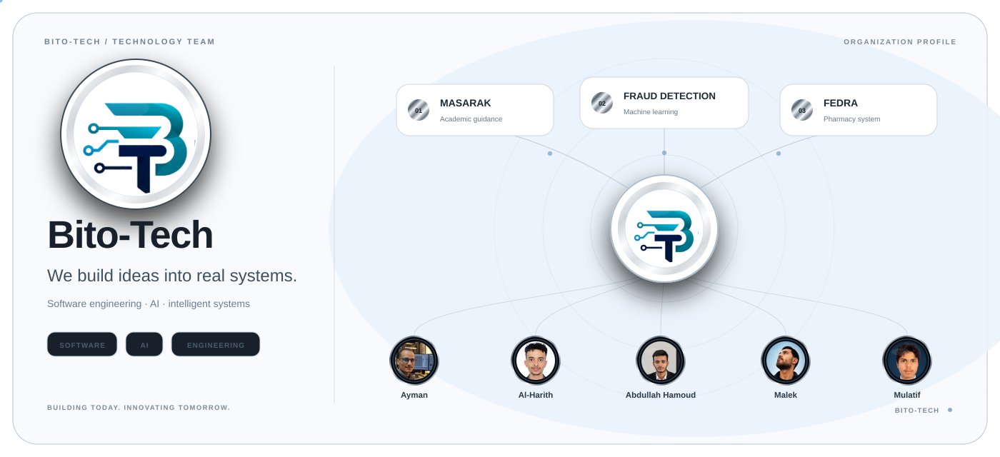

  <picture>
    <source
      media="(prefers-color-scheme: dark)"
      srcset="./assets/hero/hero-dark.svg"
    >
    <source
      media="(prefers-color-scheme: light)"
      srcset="./assets/hero/hero-light.svg"
    >
    
  </picture>

  <a href="https://github.com/Bito-Tech/msarak"><b>MASARAK</b></a>
  &nbsp;&nbsp; • &nbsp;&nbsp;
  <a href="https://github.com/Bito-Tech/fraud-detection-paysim"><b>FRAUD DETECTION</b></a>
  &nbsp;&nbsp; • &nbsp;&nbsp;
  <a href="https://github.com/Bito-Tech/fedra-pharmacy-management-system"><b>FEDRA</b></a>

 

Bito-Tech

Student-Led Technology Team

«Building Today. Innovating Tomorrow.»

Bito-Tech is a student-led technology team focused on Software Engineering, Artificial Intelligence, Web Development, and practical digital solutions.

We turn ideas into real-world software projects while developing strong engineering practices, technical skills, and collaborative teamwork.

  
  &nbsp;&nbsp;
  

---

📖 About Us

Bito-Tech was founded by Information Technology students passionate about building software, exploring emerging technologies, and solving real-world problems through technology.

Our work combines academic knowledge with practical software development, giving our team hands-on experience in software engineering, artificial intelligence, web development, databases, computer vision, and modern development practices.

We believe that the best way to learn technology is to build, test, break, improve, and build again.

---

What We Do

Software Engineering| AI & Research| Digital Solutions
Web Applications| Artificial Intelligence| Digital Image Processing
Software Engineering| Machine Learning| Database Systems
Open Source Development| Computer Vision| Technical Research

---

Featured Projects

Msarak

A web-based assessment and career guidance platform designed to provide a structured digital experience for assessment, scoring, and career-related insights.

Tech Stack

"Laravel" "PHP" "MySQL" "JavaScript"

---

AI & Computer Vision

Research and development of practical Artificial Intelligence and Computer Vision projects, exploring image processing, visual analysis, machine learning, and intelligent systems.

---

University Software Projects

Practical software systems developed to apply software engineering concepts to real-world scenarios, including web applications, desktop systems, and database-driven solutions.

---

Technologies & Tools

  

---

Engineering Mindset

We don't just focus on making software work.

We focus on understanding why it works and building it properly.

Understand the Problem
        ↓
Design the Solution
        ↓
Build
        ↓
Test
        ↓
Review
        ↓
Improve

Our development process emphasizes:

- Understanding the problem before implementation
- Maintainable and structured software
- Testing and verification
- Code review
- Git & GitHub collaboration
- Teamwork and knowledge sharing
- Continuous learning

---

Core Team

<table>
<tr>
<td align="center"><b>Abdullah Al-Basheri</b></td>
<td align="center"><b>Malik Nabil Ziyad</b></td>
<td align="center"><b>Al-Harith Al-Dahiyah</b></td>
</tr>
<tr>
<td align="center"><b>Mulatif Al-Dahiyah</b></td>
<td align="center"><b>Ayman Al-Baidhi</b></td>
<td align="center"></td>
</tr>
</table>---

Vision

Our vision is to grow from a student-led technology team into a professional software organization that builds impactful digital products, contributes to the technology community, and continuously develops its engineering capabilities.

---

Building Today. Innovating Tomorrow.

Bito-Tech

