  <picture>
    <source media="(prefers-color-scheme: dark)" srcset="./assets/hero/hero-dark.svg">
    <source media="(prefers-color-scheme: light)" srcset="./assets/hero/hero-light.svg">
    
  </picture>

 
 

  <picture>
    <source
      media="(prefers-color-scheme: dark)"
      srcset="./assets/tech/tech-network-dark.svg"
    >
    <source
      media="(prefers-color-scheme: light)"
      srcset="./assets/tech/tech-network-light.svg"
    >
    
  </picture>

 

    

 

<h3 align="center">Featured Work</h3>

  
  &nbsp;

  
  &nbsp;

  

